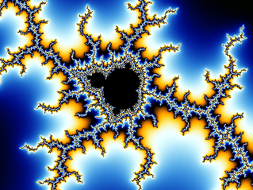

# MandelbrotGPU
A very simple Mandelbrot explorer using OpenGL, with shaders in C. Computes the Mandelbrot set on the GPU. Uses the simplest design possible. Written for Windows, but it would be very easy to port.

A (highly) scaled down capture:

